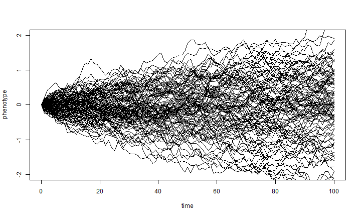

# Introduction

## Computational Economics,  2021 (MIE37)

Pablo Winant

---

### Communication for this Course

- github repository for the course: https://github.com/albop/eco309
- enroll by:
    - creating a github account if needed
    - cloning the repository
    - making a PR on students.md
- join on [Zulip](econforge.zulipchat.org) : we'll communicate in the `eco309` room
    - you're welcome to ask questions and answer other's questions (nicely)
    - outside of the course hours, I'll answer when I can
- formal or infrequent communication: `pwinant@escp.eu` with subject starting with `[eco309]`

---

### Assignments and Final Exam

-  Hands-on tutorial started in class must be (reasonably) completed by Wednesday night.
   - Optional: send them to me
   - Preferably: commit the work in your clone.
- There will be two special assignments with 14 days to complete each of them.
- Groupwork is OK.
- Final Exam will take place in the latest session.
    - It will consists of a few simple programming questions and a small model to solve yourself.
- Final Grade will weight everything.

---

### Other sources of information

- Course is mostly self-contained for its Math and Econ aspects.
- Books:

    - *Economic Dynamics: Theory and Computation* by John Stahurski
    - *Computational Economics* by Miranda & Fackler
    - *Recursive macreconomic theory* by Lars Ljungqvist & Tom Sargent
    
- Online:

    - [QuantEcon lectures](https://quantecon.org/lectures/)
- ... and all the Julia material

---

### About me

- A computational economist
- Formerly Worked in institutions (IMF, BOE)
- Now at ESCP and CREST/Polytechnique
- Research on models about:
    - Inequality (heterogeneity)
    - International Finance
    - Monetary Policy
    - Artificial Intelligence
- Involved in several opensource projects (Dolo, QuantEcon, ARK)

---

### Content of the course

- Computational Economics is made of:
    - Applied Math (theory)
    - Programming (techniques)
    - Economic Modeling (expertise)

- We'll alternate between the three topics
    - with a stronger than usual emphasis on Programming skills

---

### Math

- We won't be using very advanced math
    - linear algebra, Banach spaces, a bit of probabilities
    - working knowledge is fine
    - (almost) no proofs
- but in a context where advanced math is an option...
    - functional spaces...
- applied applied math: 
  - essentially describes the algorithms and their validity/convergence properties
  - provide some nonformal intuitions

---

### Models

- See a variety of models:
    - Static Market Determination (Computational General Equilibrium: CGE)
    - Dynamic Optimization (continous or discrete)
    - Linear Rational Expectations Models
    - Dynamic Stochastic General Equilibrium models (DSGE)
 - In discrete time
     - to avoid discretization schemes and stochastic calculus
     
- Usually a model is specified by equations and some parameter values:
    - no closed form, most of the time
    - goal is to "solve" a model to study properties of its solutions

---

### Models (2)

- random exemples of questions we can analyse numerically:
    - which sectors should receive more help during the coronavirus?  (computational general equilibrium)
    - when is it time to replace a machine? how much water should be extracted? how much should be stored? (dynamic programming)
    - what kind of shock drives the business cycles? (DSGE models)
    - is a Central Bank *able* to commit to intervene in the markets? (time inconsistency)

---

### Why economics is not Physics (1)

<iframe width="560" height="315" src="https://www.youtube.com/embed/bmUAKkisAFo" frameborder="0" allow="accelerometer; autoplay; encrypted-media; gyroscope; picture-in-picture" allowfullscreen></iframe>

- Easy!: you just swap particles for people, and simulate (or solve an IVP problem)
- <!-- .element: class="fragment" --> <b>NO</b>: Not only local interactions: economic agents interact in many ways, including through markets
    - All agents/prices must be solved at the same time

---

### Why economics is not Physics (2)

- Easy!: it's a differential equation with boundary values (BVP)
-  <!-- .element: class="fragment" --> <b>NO</b>: agents think, they are forward looking and respond to other agents' decisions
  - nonlocal interactions

---

### What makes the life of computational economists hard:

- Agents are rationnal, they should consider all possible outcomes and all decisions (and those of others...) in the future to make a decision today
    
    
   
- Very complex problem: curse of dimensionality when more than a few variables
- Agent based approach:
  -  Wait, that's crazy! People are not that smart, let's make simplifying assumptions about their behaviour
  - Methodological issues: too many possible predictions, too many parameters

---

### Why should you learn to program ?

- Econometricians, modellers, data scientists, spend a lot of time writing code
    - and do it inefficiently...
- Programming efficiently requires awareness of
    - certain basic concepts: (types, control flow, functions, objects)
    - some tools (programming language, code versioning, command line)
    - which are never taught...
- And yet they are very easy to learn
    - anyone can become an expert !

---

### Now is the right time !

- A lot of demand everywhere for skilled programmers.

- Many faculties are introducing formal programming courses (for economists)
    - NYU, Penn, MIT (see [thinking computationnally](https://computationalthinking.mit.edu/Spring21/)
    - Summer Bootcamps
    
- New applications are even more code-intensive than before:

    - data science
    - machine learning
    - modeling

---

### Do it in the open !

- Many excellent online resources:

    - [Software Carpentry](https://software-carpentry.org/)
    - [QuantEcon](https://quantecon.org/news-item/need-for-speed-in-julia) from Tom Sargent and John Stachurski
    - [Julia manuals/tutorials](https://julialang.org/learning/)
    
- Opensource community is very welcoming:

    - ask on mailing lists or online chats (Julia users, quantecon, dynare, ...)
    - open issues (for instance against Dolo [https://github.com/EconForge/Dolo.jl/issues](https://github.com/EconForge/Dolo.jl/issues)
    - participating is also a great occasion to learn

---

### Setup

- Plan A: use your own laptop. You will need:
    - visual studio code
    - Julia 1.5.3
    - git

- Plan B: use the mybinder links from the courses repository.